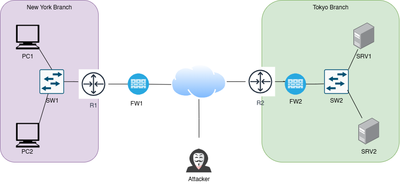

# Branch Network Lab in Cisco Packet Tracer

This folder (`lab_01`) contains a simple Packet Tracer project demonstrating a basic network design that connects two branch offices (New York and Tokyo) with firewalls, routers, and an attacker node on the public Internet. **No configuration has been applied yet**—all devices are simply cabled together.
## Network Diagram

This diagram illustrates how the New York branch, Tokyo branch, and the attacker node on the Internet are interconnected through routers and firewalls.

---
## Overview

- **New York Branch**: Two PCs connected to a switch (`SW1`), which then connects to a router (`R1`) and a firewall (`FW1`).
- **Internet**: A generic cloud symbolizing the public Internet where an attacker node is also present.
- **Tokyo Branch**: Two servers (`SRV1` and `SRV2`) connected to a switch (`SW2`), which then connects to a router (`R2`) and a firewall (`FW2`).

The goal of this initial lab is to lay out the physical connections in Cisco Packet Tracer as the foundation for future configurations. 

## Files in This Folder

- **`Lab_01.pkt`**  
  The Cisco Packet Tracer file containing:  
  - New York branch devices (PC1, PC2, SW1, R1, FW1)  
  - Tokyo branch devices (SRV1, SRV2, SW2, R2, FW2)  
  - Internet cloud and an attacker node  

- **`Lab_1_NetworkDiagram.png`**  
  A static network diagram visualizing how the branches, firewalls, and attacker node are interconnected.

## Requirements

To open and use this lab file, you’ll need:

- **Cisco Packet Tracer 7.x** (or later)

## Usage

1. Clone or download the `CCNA-Prep-Lab` repository to your local machine.
2. Navigate to `lab_01` within the repository.
3. Open the **`Lab_01.pkt`** file in Cisco Packet Tracer.
4. Explore the devices and their connections in the workspace.
5. Begin setting up IP addressing, routing, firewall rules, and other configurations as your lab exercise evolves.

## Contributing

Contributions in the form of suggestions, improvements, or additional configurations are always welcome. Please feel free to create issues or open pull requests!

---

**Happy Networking!**
