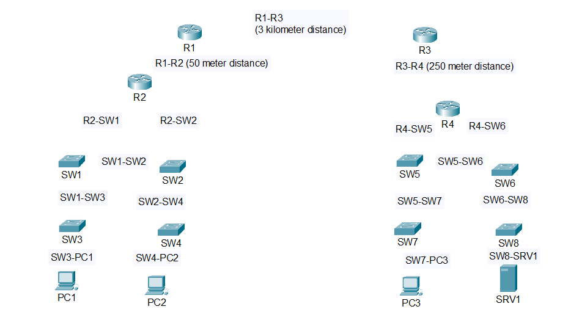

# Lab 02: Connecting Network Devices in Packet Tracer

This lab provides step-by-step instructions for selecting and applying the correct cables to connect routers, switches, PCs, and servers across varying distances. Because **Auto MDI-X** is assumed to be disabled, it is necessary to determine when to use straight-through, crossover, or fiber cables based on the devices and distances involved.

> **Note**: Cisco Packet Tracer uses a single “fiber” connection icon and does not differentiate between single-mode and multimode fiber. For the purposes of this lab, treat all fiber connections as single-mode or multimode as appropriate for the distance.

---

## Diagram Before Connecting Cables

Below is the initial topology **without** any cables. The goal is to select and connect the correct types of cables in Packet Tracer following the lab instructions.

---

## Lab Objectives

1. Practice choosing between straight-through, crossover, and fiber (single-mode or multimode) cables.  
2. Understand how different device types (PC, switch, router) handle transmit/receive pins.  
3. Recognize distance limitations for copper and fiber connections.

---

## Connection Guidelines

1. **PC/Server to Switch**  
   - Use **straight-through** copper cables.  
   - PCs and servers transmit on pins 1 & 2, receive on pins 3 & 6. Switches do the opposite, making straight-through suitable.

2. **Switch to Switch**  
   - Use **crossover** copper cables (same device type).  
   - Both switches transmit on pins 3 & 6 and receive on pins 1 & 2.

3. **Switch to Router**  
   - Use **straight-through** copper cables.  
   - Routers transmit on pins 1 & 2 and receive on pins 3 & 6, matching up with switch pins in a straight-through setup.

4. **Router to Router**  
   - Same device type → typically requires **crossover** when using copper, unless distance exceeds copper limits.  
   - For longer distances, use fiber (single-mode or multimode as appropriate). In Packet Tracer, the same fiber cable icon is used for both types.

---

## Distance Constraints

- **Copper (UTP)**  
  - Maximum recommended length of **100 m**.  
  - Example: R1 ⇄ R2 at 50 m is suitable for copper crossover.

- **Fiber (in Packet Tracer)**  
  - Use the generic “fiber” cable option and apply single-mode or multimode concepts as follows:
    - **Multimode**: Up to ~550 m (for shorter runs).  
    - **Single-mode**: Up to several kilometers.  
  - Example connections:  
    - R1 ⇄ R3 at 3 km → single-mode fiber.  
    - R3 ⇄ R4 at 250 m → multimode fiber.

---

## Steps to Complete

1. **Open the Lab File**  
   - Launch Cisco Packet Tracer and open the `.pkt` file associated with Lab 02.

2. **Connect PCs/Server to Switches**  
   - Use **straight-through** cables between the FastEthernet port on each PC/Server and the FastEthernet port of its designated switch.

3. **Connect Switches to Each Other**  
   - Use **crossover** cables to link switches.

4. **Connect Switches to Routers**  
   - Use **straight-through** cables between switch ports and router interfaces.

5. **Connect Routers to Routers**  
   - Use **copper crossover** if within 100 m.  
   - Use **fiber** for distances over 100 m, applying **multimode** logic for shorter distances (≤550 m) and **single-mode** for longer distances (≥1 km).  
   - In Packet Tracer, only one fiber cable type is shown, so select the generic fiber cable but keep in mind the intended type.

6. **Verify Link Status**  
   - Check for green link lights or active status indicators in Packet Tracer.  
   - If a link is inactive, confirm the correct cable type and port assignments.

---

## Contributing

Suggestions for improving this lab or expanding on cable selection scenarios are welcome. Please open an issue or submit a pull request in the repository to share feedback.

---

**Happy Networking!**
