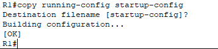

# Lab 03: Basic IOS CLI Configuration

This lab introduces foundational CLI (Command Line Interface) tasks on Cisco routers such as setting hostnames, configuring privileged EXEC passwords, and enabling password encryption. The goal is to practice navigating between different configuration modes, apply basic security controls, and verify the running configuration.

---

## Lab Objectives

1. **Set Hostnames**  
   - Change device’s hostname (for example, to `R1`) using the `hostname` command.
2. **Configure an Unencrypted Enable Password**  
   - Protect privileged EXEC mode with `enable password CCNA`.
   - Verify the password prompt by re-entering privileged EXEC mode.
3. **View the Running Configuration**  
   - Use the `show running-config` (or `sh run`) command to view the current configuration, including the unencrypted password.
4. **Enable Basic Password Encryption**  
   - Apply `service password-encryption` in global configuration mode to obscure plain-text passwords (Type 7 encryption).
5. **Verify Encrypted Passwords**  
   - Check the running configuration again to confirm passwords are no longer shown in clear text.
6. **Configure an Enable Secret**  
   - Set a more secure, MD5-encrypted password using `enable secret Cisco`.
   - Observe that the `enable secret` overrides the unencrypted `enable password`.
7. **Test the Enable Secret**  
   - Exit to user EXEC mode and re-enter privileged EXEC mode with the new `enable secret`.
8. **View Updated Passwords**  
   - Use `show running-config` once more to see both the Type 7 (`enable password`) and Type 5 (`enable secret`) passwords in the config.
9. **Save the Configuration**  
   - Persist changes using one of the following commands:  
     - `copy running-config startup-config`  
     - `write`  
     - `write memory`  

---

## Recommended Procedure

1. **Access the CLI**  
   - In Packet Tracer, click on each device and open the **CLI** tab, or connect a **console** cable to a PC if simulating a more realistic setup.

2. **Enter Privileged EXEC Mode**  
   - Use the `enable` (or `en`) command to reach privileged EXEC mode.

     

3. **Enter Global Configuration Mode**  
   - Use `configure terminal` (or `conf t`) to begin making global changes.
  
     

4. **Apply Each Task**  
   - Hostname → `hostname R1`, `hostname SW1`, etc.  
   - Enable Password → `enable password CCNA`  
   - Service Password-Encryption → `service password-encryption`  
   - Enable Secret → `enable secret Cisco`
  
     

5. **Verify Configuration**  
   - Use `do show running-config` (or `do sh run`) to confirm the configurations and check password encryption status.
  
     

6. **Save the Configuration**  
   - Preserve the running config to the startup config with `copy running-config startup-config`.
  
     
     
7. **Verify Saved Configuration**
   - Check if the configuration has been saved by displaying the startup configuration using `show startup-config`.
  
     
   
---

**Happy Configuring!**

