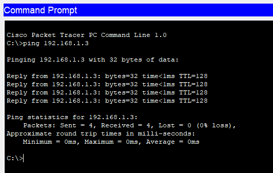
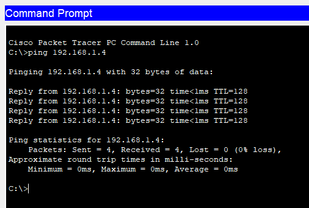
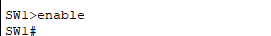
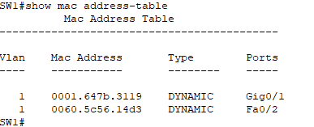
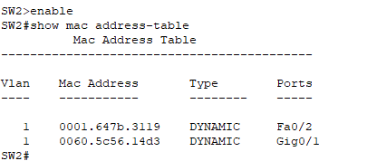
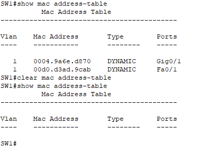
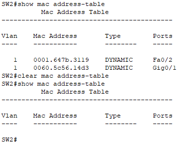

# Lab 04: Ethernet LAN Switching and MAC Address Tables

This lab focuses on Ethernet LAN switching concepts, covering how switches learn MAC addresses, how to verify and clear MAC address tables, and how to use show commands for troubleshooting. The lab follows a step-by-step process using Cisco CLI commands.

---

## Lab Objectives

- Send pings between devices to allow switches to dynamically learn MAC addresses.  
- Identify stored MAC addresses on switches using the `show mac address-table` command.  
- Clear dynamically learned MAC addresses using the `clear mac address-table dynamic` command.

---

## Lab Topology

The network consists of:  
- Two **switches** (`SW1` and `SW2`).  
- Four **PCs** (`PC1`, `PC2`, `PC3`, `PC4`).  

Each PC is connected to a switch, and the two switches are connected.

---

## Configuration Steps

1. First, generate network traffic by sending a ping from `PC1` to `PC3` to allow switches to learn MAC addresses:
   - Use the `ping 192.168.1.3` command to send a ping from `PC1` to `PC3` and allow switches to learn MAC addresses.

   
   
2. Then, send another ping from `PC2` to `PC4` so that switches can learn their MAC addresses:
   - Use the `ping 192.168.1.4` command to send a ping from `PC2` to `PC4` and allow switches to learn their MAC addresses.
    
   

3. Identify the MAC addresses stored in the switch MAC address tables.
   On SW1, enter privileged EXEC mode:
   -   Use the `enable` (or `en`) command to reach privileged EXEC mode on a switch.
     
       
   
   -   Use the `show mac address-table` command to display the current MAC address table of the SW1.
   
       

4. On SW2, use the same show mac address-table command to determine the exact interfaces for PC3 and PC4:
    -   Use the `show mac address-table` command to display the current MAC address table of the SW2.

        

5. Clear the MAC address table to remove all dynamically learned MAC addresses.
On SW1, enter privileged EXEC mode:

      - Use the `clear mac address-table` dynamic command to remove all dynamically learned MAC addresses from the switch’s table.
   
      Verify that the table is empty:
 
      - Use the `show mac address-table` command again after clearing to verify that the MAC address table is empty.
   
          

6. Repeat the same steps on SW2 to clear its MAC address table:

     

---

**Happy Configuring!**
