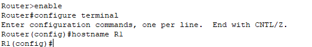
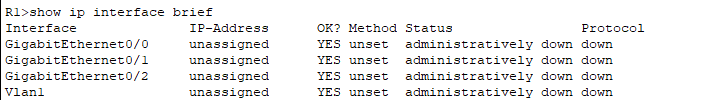
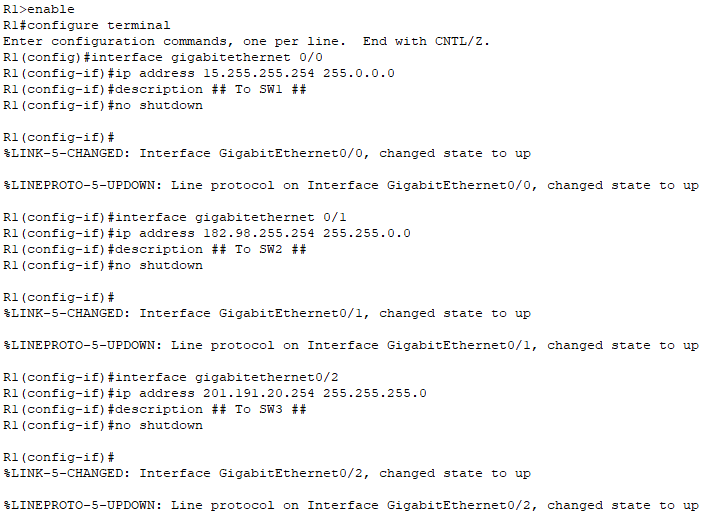
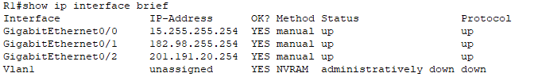
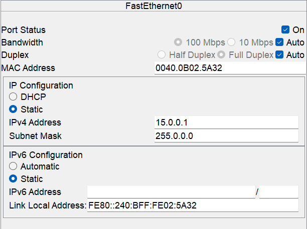
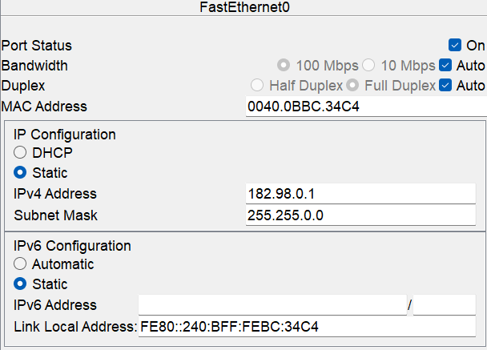
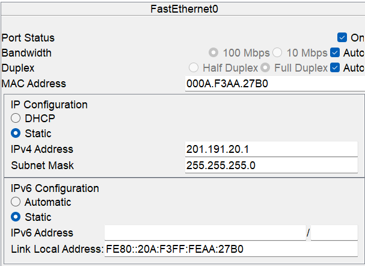
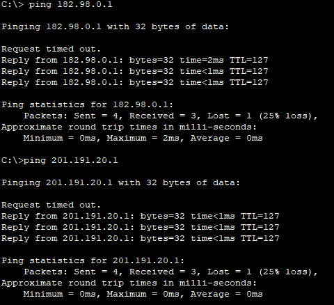

# Lab: Configuring IP Addresses on a Cisco Router

This lab focuses on configuring IP addresses on a Cisco router, enabling interfaces, and verifying configurations using Cisco CLI commands.

---

## Lab Objectives

- Configure IP addresses on router interfaces.
- Use `show ip interface brief` command to verify interface statuses and configurations.
- Use `no shutdown` command to enable interfaces.
- Configure IP addresses on PCs and use `ping` command to test connectivity.

---

## Lab Topology

The network consists of:  
- **One router** (R1)  
- **Three switches** (SW1, SW2, SW3)  
- **Three PCs** (PC1, PC2, PC3)  

### Network Addressing:
- **Class A Network**: 15.0.0.0/8
- **Class B Network**: 182.98.0.0/16
- **Class C Network**: 201.191.20.0/24

---

## Configuration Steps

### Step 1: Configure R1's Hostname

1. Use `enable` command to access R1’s CLI and enter privileged EXEC mode.
2. Use `configure terminal` command to enter global configuration mode.
3. Use `hostname R1` command to set the hostname.

   

### Step 2: Verify R1's Interfaces

1. Use `show ip interface brief` command to view available interfaces and their statuses.

   

### Step 3: Configure IP Addresses and Enable Interfaces on R1

1. Use `interface gigabitethernet0/0` command to enter interface mode.
2. Use `ip address 15.255.255.254 255.0.0.0` command to assign an IP address.
3. Use `description ## To SW1 ##` command to set a description.
4. Use `no shutdown` command to enable the interface.

5. Use `interface gigabitethernet0/1` command to enter interface mode.
6. Use `ip address 182.98.255.254 255.255.0.0` command to assign an IP address.
7. Use `description ## To SW2 ##` command to set a description.
8. Use `no shutdown` command to enable the interface.

9. Use `interface gigabitethernet0/2` command to enter interface mode.
10. Use `ip address 201.191.20.254 255.255.255.0` command to assign an IP address.
11. Use `description ## To SW3 ##` command to set a description.
12. Use `no shutdown` command to enable the interface.

    

### Step 4: Verify Interface Configuration

1. Use `show ip interface brief` command to check the interface status.

   

### Step 5: Save Configuration

1. Use `write memory` command to save the running configuration.

   

---

## Configuring IP Addresses on PCs

1. Use `IP address 15.0.0.1 255.0.0.0` command to configure PC1's IP address.

   
3. Use `IP address 182.98.0.1 255.255.0.0` command to configure PC2's IP address.

   
5. Use `IP address 201.191.20.1 255.255.255.0` command to configure PC3's IP address.

   

---

## Step 6: Testing Connectivity

### Ping Between Devices

1. Use `ping 182.98.0.1` command on PC1 to test connectivity to PC2.
2. Use `ping 201.191.20.1` command on PC1 to test connectivity to PC3.

   

---

**Happy Configuring!**
